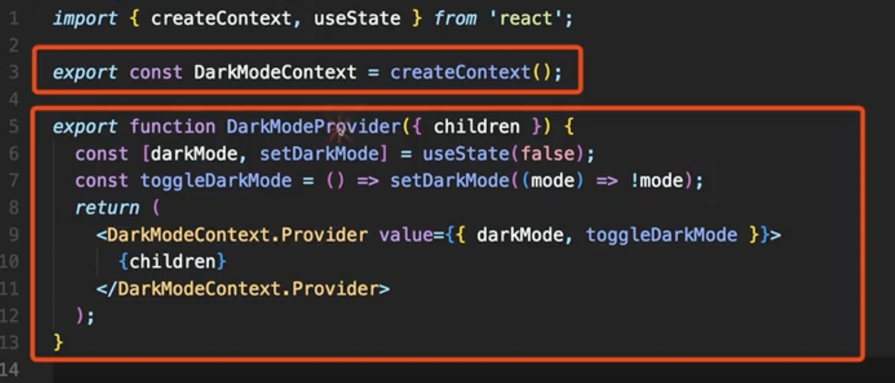

# 23_May_21
## 오늘 학습한 내용
1. React Hook ( useReducer, useImmer, useContext)
2. 컴포넌트의 재사용

---

## 헷갈리는 내용

1.

---

## 학습하면서 궁금했던 내용
- useImmer 를 사용하면 useState를 사용하지 않아도 될것같은데 어떨때 사용하고 단점으로는 무엇이 있을까?
    - useImmer를 사용하지 않은 코드가 미세하지만 빠르다.
        - 데이터구조가 복잡하지않다면 사용을 최소화 할 것.
---

- 비제어컴포넌트와 제어컴포넌트는 어떤경우에 사용해야 할것인가
    - 내가 사용하고 싶은 의도가 중요한 것 같다  
    만약에 회원가입을 하는 컴포넌트가 있는데, 이때 사용자가 아이디 입력칸의 입력을 받아와서 몇글자 이하라면 이벤트를 추가하고싶다면 사용자의 UI에 입력된 데이터와 받아올 데이터가 일치해야 하기 때문에 제어컴포넌트를 사용하는 것이 맞는것 같다.
---
- useContext를 사용할 때 강사가 아래 이미지와 같이 사용한 이유?
    - 
    - 최상위 컴포넌트의 코드가 간결해지는 것 같다.
    - 실수를 줄이고 재사용성이 높을 것 같다.
    

